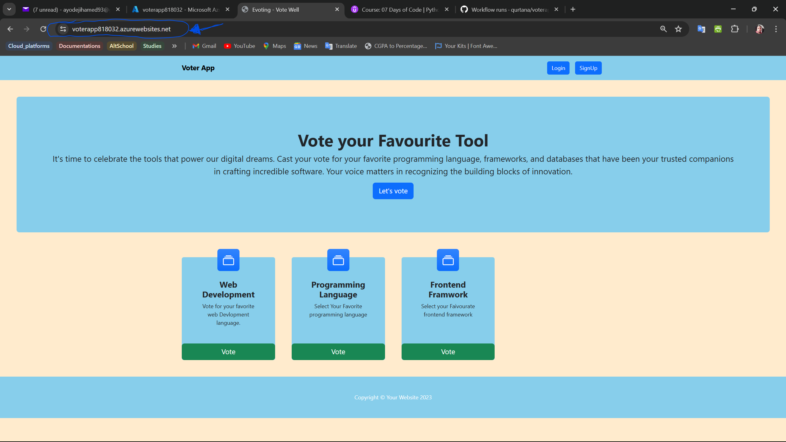
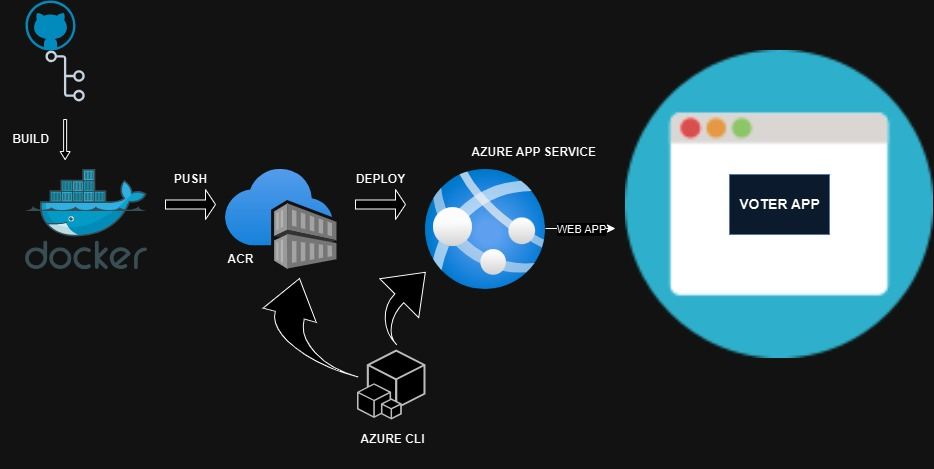

# Deployment of Containerized Voting Application on Azure App Service using Docker and Azure Container Registry (ACR)

## Table of Contents

- [Introduction](#introduction)
- [Attribution](#attribution)
- [Project Task: Deployment of Containerized Voting Application](#project-task-deployment-of-containerized-voting-application)
- [Project Solution: Deployment of Containerized Voting Application using Azure CLI](#project-solution-deployment-of-containerized-voting-application-using-azure-cli)
- [Conclusion](#conclusion)

## Introduction

This is a simple Django-based web application that allows users to vote on various categories. Users can view available categories, vote for their favorite items in each category, and see the voting results in real-time. The application is containerized using Docker and deployed on Azure App Service using Azure Container Registry (ACR). The application is built using Django, a high-level Python web framework that encourages rapid development and clean, pragmatic design.



## Attribution

This project uses a voting application from the following repository:

- **Original Repository**: [GitHub - Original Voting App](https://github.com/SuryaPratap2542/Voting-Site)
- **Author**: [Original Author's Name](https://github.com/SuryaPratap2542)
- **License**: MIT License

I have made the following modifications to the original code:

- Because Django checks the Host header in the incoming HTTP request, and if it doesn't match any of the hosts specified in the `ALLOWED_HOSTS` setting, it will reject the request and throw a DisallowedHost exception. I added my app service web app default domain to the `ALLOWED_HOSTS` setting in the `settings.py` file.

    ```python
    ALLOWED_HOSTS = ['voterapp818032.azurewebsites.net']
    ```

- Django checks that every POST request is accompanied by a CSRF token. This token is used to protect the application from CSRF attacks by ensuring that the requests are only accepted from trusted origins, so I added my app service web app default domain to the `CSRF_TRUSTED_ORIGINS` setting in the `settings.py` file.

    ```python
    CSRF_TRUSTED_ORIGINS = ['http://voterapp818032.azurewebsites.net', 'https://voterapp818032.azurewebsites.net']
    ```

- I added a `Dockerfile` to containerize the application and a `docker-compose.yml` file to define the services required to run the application.

- I added a `.dockerignore` file to exclude unnecessary files and directories from the Docker build context.

## Project Task: Deployment of Containerized Voting Application

**Objective**:
Deploy a containerized voting application using Docker, Azure Container Registry (ACR), and Azure App Service.

**Steps**:

1. **Containerize the Voting Application**:
   - Use Docker to containerize the voting application.

2. **Push Docker Image to Azure Container Registry (ACR)**:
   - Configure ACR to store the Docker image.
   - Push the Docker image to ACR.

3. **Deploy to Azure App Service**:
   - Use Azure App Service to deploy the containerized voting application.
   - Configure the app service to pull the Docker image from ACR.

**Details**:

- **Azure Container Registry (ACR)**: Serves as the storage location for the Docker image of the voting application.
- **Azure App Service**: Hosts and runs the containerized application, providing a scalable and managed environment.

**Repository**: [Voting Application on GitHub](https://github.com/SuryaPratap2542/Voting-Site)

**Outcome**:
Successfully deploying the voting application ensures that it is containerized, stored in ACR, and running in a scalable environment on Azure App Service. This setup leverages Azure’s cloud infrastructure for efficient and reliable application deployment and management.

## Project Solution: Deployment of Containerized Voting Application using Azure CLI

**Solution Overview**:
The solution involves three main stages: containerizing the application, pushing the Docker image to Azure Container Registry (ACR), and deploying the application using Azure App Service.



**Implementation Steps**:

1. **Containerizing the Voting Application**:
   - **Dockerfile Creation**:
     - Write a `Dockerfile` to define the application’s environment, dependencies, and startup commands.
     - Example:

       ```dockerfile
       FROM python:3.11-alpine3.19
       ENV PYTHONBUFFERED=1
       WORKDIR /app
       COPY requirements.txt requirements.txt
       COPY . .
       RUN pip install -r requirements.txt
       CMD python manage.py runserver 0.0.0.0:8000
       ```

       This configuration uses `python:3.11-alpine3.19` as the base image, sets the working directory to `/app`, copies the application files, installs dependencies from `requirements.txt`, and runs the Django server.

   - **Docker Compose**:
     - Create a `docker-compose.yml` file to define the services required to run the application.
     - Example:

       ```yaml
       version: "3.11"
       services:
         app:
           build: .
           volumes:
             - .:/app
           ports:
             - 8000:8000
           image: voterapp.azurecr.io/voter-app:django
           container_name: voter-app
           command: python manage.py runserver 0.0.0.0:8000
       ```

       This configuration builds the Docker image from the current directory, mounts the application files, exposes port 8000, and runs the Django server. The image is tagged for ACR.

   - **Build Docker Image**:
     - Build the Docker image locally.

       ```sh
       docker-compose build
       ```

       This command builds the Docker image based on the `Dockerfile` and `docker-compose.yml` configuration. The image is tagged with the specified name, and the command is run in the same directory as the `Dockerfile` and `docker-compose.yml`.

2. **Pushing Docker Image to Azure Container Registry (ACR)**:
   - **Create an Azure Container Registry**:
     - Create an ACR instance using the Azure portal or CLI.

       ```sh
       az acr create --resource-group voterapp --name voterapp --sku Basic
       ```

       This command creates an ACR instance named `voterapp` in the `voterapp` resource group with the Basic pricing tier. The Basic tier is suitable for development and testing purposes.

     - Admin access to the ACR instance can be granted using the following command:

       ```sh
       az acr update --name voterapp --admin-enabled true
       ```

       This command enables admin access to the ACR instance, allowing the user to push and pull images without authentication.

   - **Login to ACR**:
     - Log in to the ACR instance.

       ```sh
       az acr login --name voterapp
       ```

   - **Tag and Push Docker Image**:
     - The image has been tagged already in the `docker-compose.yml` file, so the image can be pushed to ACR using the following command:

       ```sh
       docker push voterapp.azurecr.io/voter-app:django
       ```

       This command pushes the Docker image to the ACR instance. The image is tagged with the ACR URL and the specified name.

3. **Deploying to Azure App Service**:
   - **Create an App Service Plan**:
     - Create an App Service plan to host the application.

       ```sh
       az appservice plan create --name myVoterAppServicePlan --resource-group voterapp --sku F1 --is-linux
       ```

       This command creates an App Service plan named `myVoterAppServicePlan` in the `voterapp` resource group with the F1 pricing tier. The `--is-linux` flag specifies that the plan is for Linux-based App Service.

   - **Create a Web App**:
     - Create a web app within the App Service plan and configure it to use the Docker image from ACR.

       ```sh
       az webapp create --resource-group voterapp --plan myVoterAppServicePlan --name voterapp818032 --deployment-container-image-name voterapp.azurecr.io/voter-app:django
       ```

       This command creates a web app named `voterapp818032` in the `voterapp` resource group using the `myVoterAppServicePlan` plan. The web app is configured to use the Docker image from ACR.

   - **Configure Ports and Environment Variables**:
     - Configure the web app to expose the required ports and set environment variables.

       ```sh
       az webapp config appsettings set --name voterapp818032 --resource-group voterapp --settings WEBSITES_PORT=8000
       ```

       This command sets the `WEBSITES_PORT` environment variable to `8000` for the web app, allowing it to expose port 8000.

   - **View Web App**:
     - Access the web app using the provided URL.

       ```sh
       az webapp browse --name voterapp818032 --resource-group voterapp
       ```

       This command opens the web app in the default browser, allowing you to view the deployed application.

   - **Configure Continuous Deployment (Optional)**:
     - Set up continuous deployment using GitHub Actions to automate future deployments.

       ```yaml
        name: deploy-container

        on:
          push:
            branches:
              - main
            paths:
              - 'app/**'

        permissions:
          id-token: write
          contents: read

        env:
          REGISTRY_NAME: 'voterapp'
          IMAGE_NAME: 'voter-app'
          IMAGE_TAG: 'django'
          WEBAPP_NAME: 'voterapp818032'
          WEBAPP_RESOURCE_GROUP: 'voterapp'


        jobs:
          build:
            runs-on: ubuntu-latest

            steps:
              - name: Checkout
                uses: actions/checkout@v4

              - name: Azure Login
                uses: Azure/login@v2.1.0
                with:
                  client-id: ${{ secrets.AZURE_CLIENT_ID }}
                  tenant-id: ${{ secrets.AZURE_TENANT_ID }}
                  subscription-id: ${{ secrets.AZURE_SUBSCRIPTION_ID }}

              - name: Build and push Docker image
                run: |
                  docker-compose -f app/docker-compose.yml build
                  docker login ${{ env.REGISTRY_NAME }}.azurecr.io -u ${{ env.REGISTRY_NAME }} -p ${{ secrets.REGISTRY_PASSWORD }}
                  docker push ${{ env.REGISTRY_NAME }}.azurecr.io/${{ env.IMAGE_NAME }}:${{ env.IMAGE_TAG }}

              - name: Restart webapp
                run: |
                  az webapp restart --name ${{ env.WEBAPP_NAME }} --resource-group ${{ env.WEBAPP_RESOURCE_GROUP }}

              - name: logout
                run: |
                  az logout
                if: always()
       ```

**Outcome**:
The containerized voting application is successfully deployed on Azure. The solution ensures a scalable and manageable deployment, leveraging Azure's infrastructure for reliability and performance. By using ACR for Docker image storage and Azure App Service for hosting, the application benefits from streamlined deployment processes and automated updates.

## Conclusion

The deployment of the containerized voting application on Azure App Service using Docker and Azure Container Registry (ACR) demonstrates the power of cloud-based solutions for application hosting. By containerizing the application, storing the Docker image in ACR, and deploying it on App Service, we create a scalable and reliable environment for running the application. Leveraging Azure's cloud infrastructure simplifies the deployment process and ensures efficient management of the application. This project showcases the benefits of using cloud services for deploying and hosting applications, enabling developers to focus on building and improving their applications without worrying about infrastructure management.
